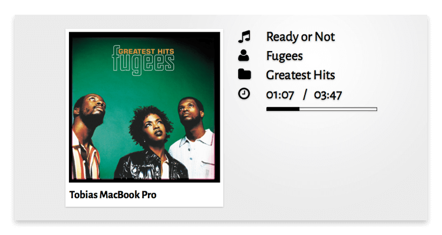

# mirrOS Spotify Modul

Das Spotify-Modul zeigt den zurzeit auf deinem Gerät spielenden Track ins glancr mirrOS.

## Voraussetzungen

* Spotify-Account
* Spotify Client ID ([zum Tutorial](https://glancr.de/tutorials/das-spotify-modul-konfigurieren/))
* Spotify Client Secret ([zum Tutorial](https://glancr.de/tutorials/das-spotify-modul-konfigurieren/))
* Raspberry mit installiertem [mirrOS](https://glancr.de/mirr-os/)

## Download

Du kannst dir [hier](https://glancr.de/module/home-automation/spotify/) die neuste Version des Moduls herunterladen.  
Die Modul-Updates werden direkt via mirrOS-Backend installiert.

## Das Modul in Aktion

## Weitere Informationen
* [Spotify-Modul](https://glancr.de/module/home-automation/spotify/)
* [Glancr](https://glancr.de)
* [mirrOS](https://glancr.de/#mirr_os)

## Andere Module

Besuche meine Entwicklerseite und schau dir meine anderen Module an: 
[Marco Roth auf glancr.de](https://glancr.de/entwickler/marco-roth/)
